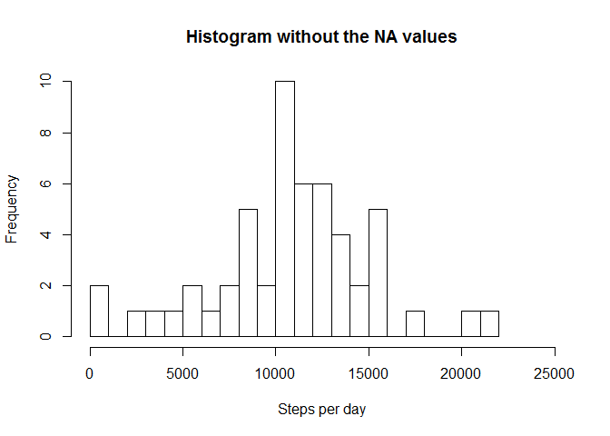
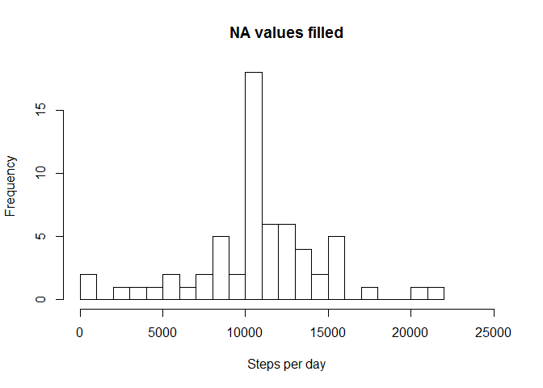
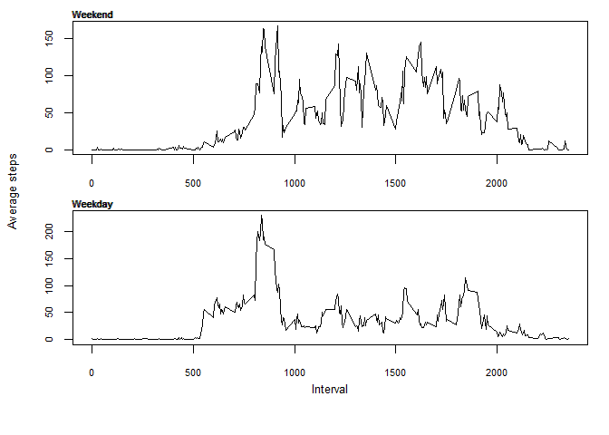

# Reproducible Research: Peer Assessment 1

To show this, the library lubridate has to be installed.

## Loading and preprocessing the data

First read the data. The file has to be in the working directory. It doesn't matter if only the "activity.zip" exists in the working directory. 
The date column will be transformed to a date. 

The names "steps","date","interval" will be added for the columns. 


```r
    if (!file.exists("activity.csv")) 
    {
        unzip("activity.zip")
    }
    data <- read.csv("activity.csv", col.names=c("steps","date","interval"))
    data$date <- as.Date(data$date)
```


## What is mean total number of steps taken per day?

Calculate the total number of steps taken per day.


```r
   stepsPerDay <- aggregate(steps ~ date, data, sum)
   stepsPerDay
```

```
##          date steps
## 1  2012-10-02   126
## 2  2012-10-03 11352
## 3  2012-10-04 12116
## 4  2012-10-05 13294
## 5  2012-10-06 15420
## 6  2012-10-07 11015
## 7  2012-10-09 12811
## 8  2012-10-10  9900
## 9  2012-10-11 10304
## 10 2012-10-12 17382
## 11 2012-10-13 12426
## 12 2012-10-14 15098
## 13 2012-10-15 10139
## 14 2012-10-16 15084
## 15 2012-10-17 13452
## 16 2012-10-18 10056
## 17 2012-10-19 11829
## 18 2012-10-20 10395
## 19 2012-10-21  8821
## 20 2012-10-22 13460
## 21 2012-10-23  8918
## 22 2012-10-24  8355
## 23 2012-10-25  2492
## 24 2012-10-26  6778
## 25 2012-10-27 10119
## 26 2012-10-28 11458
## 27 2012-10-29  5018
## 28 2012-10-30  9819
## 29 2012-10-31 15414
## 30 2012-11-02 10600
## 31 2012-11-03 10571
## 32 2012-11-05 10439
## 33 2012-11-06  8334
## 34 2012-11-07 12883
## 35 2012-11-08  3219
## 36 2012-11-11 12608
## 37 2012-11-12 10765
## 38 2012-11-13  7336
## 39 2012-11-15    41
## 40 2012-11-16  5441
## 41 2012-11-17 14339
## 42 2012-11-18 15110
## 43 2012-11-19  8841
## 44 2012-11-20  4472
## 45 2012-11-21 12787
## 46 2012-11-22 20427
## 47 2012-11-23 21194
## 48 2012-11-24 14478
## 49 2012-11-25 11834
## 50 2012-11-26 11162
## 51 2012-11-27 13646
## 52 2012-11-28 10183
## 53 2012-11-29  7047
```

Show the histogram, mean and median. 


```r
   hist(stepsPerDay$steps, breaks=20, xlim=c(0,25000), xlab="Steps per day", main="Histogram without the NA values")
```

 

```r
   mean(stepsPerDay$steps) 
```

```
## [1] 10766.19
```

```r
   median(stepsPerDay$steps)
```

```
## [1] 10765
```

## What is the average daily activity pattern?

Show a plot for the average steps for each interval.
	

```r
   intervalSteps <- aggregate(steps ~ interval, data, mean)
   plot(intervalSteps$interval, intervalSteps$steps, type="l", xlab="Interval", ylab="Average steps")
```

 

Find the interval with the highest average


```r
   maxInterval <- intervalSteps[intervalSteps$steps==max(intervalSteps$steps),]
   maxInterval$interval
```

```
## [1] 835
```
	

## Imputing missing values

Find out the rows with missing values


```r
   naVector <- is.na(data$steps)
   nullData <- data[naVector,]
   nrow(nullData)
```

```
## [1] 2304
```

Now fill the missing fields with the mean of the corresponding interval. i.E the value in the row of interval 0 will be filled with the mean of all steps in the interval 0.


```r
   f <- merge(data, intervalSteps, by="interval", all = TRUE)
   f$steps <- ifelse(is.na(f$steps.x), f$steps.y, f$steps.x) 
   newData <- f[,c(1,3,5)]
```

Show the histogram, mean and median with the missing values filled. 


```r
   newStepsPerDay <- aggregate(steps ~ date, newData, sum)
   newStepsPerDay
```

```
##          date    steps
## 1  2012-10-01 10766.19
## 2  2012-10-02   126.00
## 3  2012-10-03 11352.00
## 4  2012-10-04 12116.00
## 5  2012-10-05 13294.00
## 6  2012-10-06 15420.00
## 7  2012-10-07 11015.00
## 8  2012-10-08 10766.19
## 9  2012-10-09 12811.00
## 10 2012-10-10  9900.00
## 11 2012-10-11 10304.00
## 12 2012-10-12 17382.00
## 13 2012-10-13 12426.00
## 14 2012-10-14 15098.00
## 15 2012-10-15 10139.00
## 16 2012-10-16 15084.00
## 17 2012-10-17 13452.00
## 18 2012-10-18 10056.00
## 19 2012-10-19 11829.00
## 20 2012-10-20 10395.00
## 21 2012-10-21  8821.00
## 22 2012-10-22 13460.00
## 23 2012-10-23  8918.00
## 24 2012-10-24  8355.00
## 25 2012-10-25  2492.00
## 26 2012-10-26  6778.00
## 27 2012-10-27 10119.00
## 28 2012-10-28 11458.00
## 29 2012-10-29  5018.00
## 30 2012-10-30  9819.00
## 31 2012-10-31 15414.00
## 32 2012-11-01 10766.19
## 33 2012-11-02 10600.00
## 34 2012-11-03 10571.00
## 35 2012-11-04 10766.19
## 36 2012-11-05 10439.00
## 37 2012-11-06  8334.00
## 38 2012-11-07 12883.00
## 39 2012-11-08  3219.00
## 40 2012-11-09 10766.19
## 41 2012-11-10 10766.19
## 42 2012-11-11 12608.00
## 43 2012-11-12 10765.00
## 44 2012-11-13  7336.00
## 45 2012-11-14 10766.19
## 46 2012-11-15    41.00
## 47 2012-11-16  5441.00
## 48 2012-11-17 14339.00
## 49 2012-11-18 15110.00
## 50 2012-11-19  8841.00
## 51 2012-11-20  4472.00
## 52 2012-11-21 12787.00
## 53 2012-11-22 20427.00
## 54 2012-11-23 21194.00
## 55 2012-11-24 14478.00
## 56 2012-11-25 11834.00
## 57 2012-11-26 11162.00
## 58 2012-11-27 13646.00
## 59 2012-11-28 10183.00
## 60 2012-11-29  7047.00
## 61 2012-11-30 10766.19
```

```r
   hist(newStepsPerDay$steps, breaks=20, xlim=c(0,25000), xlab="Steps per day", main="NA values filled")
```

 

```r
   mean(newStepsPerDay$steps) 
```

```
## [1] 10766.19
```

```r
   median(newStepsPerDay$steps)
```

```
## [1] 10766.19
```

There are no substantial difference between the histograms with and without the NA values  

## Are there differences in activity patterns between weekdays and weekends?

Use the library "lubridate" instead of weekdays() to get rid of the names in the locale in use.


```r
   #install.packages("lubridate")
   library(lubridate)
```

```
## Warning: package 'lubridate' was built under R version 3.2.2
```

Add a factor variable in the dataset indicating whether a given date is a weekday or weekend
day. 


```r
   newData$day <- ifelse(wday(newData$date) == 1, "weekend", 
                  ifelse(wday(newData$date) == 7, "weekend", "weekday"))
                       
   newData$day <- as.factor(newData$day)
```

Calculate the mean for the weekend and the weekdays


```r
   weekEnd <- aggregate(steps ~ interval, newData[newData$day == "weekend",], mean) 
   weekDay <- aggregate(steps ~ interval, newData[newData$day == "weekday",], mean) 
```

Show the two plots.


```r
   par(mfrow = c(2,1), cex.axis=0.7, 
          oma = c(3,4,0,0) + 0.1,
          mar = c(2,0,1,1) + 0.1)   
   plot(weekEnd$interval, weekEnd$steps, type="l", ylab="", xlab="")
   mtext("Weekend", at= c(6,5), cex=0.7)

   plot(weekDay$interval, weekDay$steps, type="l", ylab="", xlab="")
   mtext("Weekday", at= c(6,5), cex=0.7)

   mtext("Interval", side=1, line = 2, cex=0.8)
   title(ylab = "Average steps", cex.lab=0.8, outer = TRUE)
```

 

There is no difference in activity patterns between weekdays and weekend.
